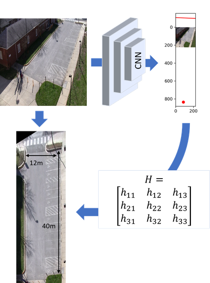

# birds-eye-view

Welcome to the code repository for ["A Geometric Approach to Obtain a Bird's Eye View from an Image", Ammar Abbas, Andrew Zisserman](https://arxiv.org/abs/1905.02231). The code estimates the homography matrix for a bird's eye view transformation along with some of the cameras's intrinsic and extrinsic parameters.



## Pre-requisites

This code was written in TensorFlow 1.8 and Python 3.6.8 (unless specified otherwise). However, it has been tested until TensorFlow 1.13.1 and may work with other Python versions as well.
Some of the main libraries being used are:

1. TensorFlow
2. OpenCV
3. Numpy
4. Matplotlib (for visualization)

### Creating virtual env

If you want to create a fresh environment, you can install the pre-requisite packages by running the following command in the main code directory:

```
pip install -r requirements.txt
```

**Note:** You will need to install TensorFlow separately. I have removed tensorflow from requirements because it depends on CUDA version etc.

## How to run?

### Generate CARLA-VP dataset

This script specifically requires Python 3.7.* if you intend to use it without any modification. This is because it was written for CARLA 0.9.4 in Windows 10 experimental version. To run, first start CARLA engine, then open the terminal and type:

```
python scripts/generate_carla_van_dataset.py
```

**Note**: The parameters can be changed in the file (lines 202-232 currently) directly.

### Training on CARLA-VP dataset

#### Data
Please find the dataset [here](https://drive.google.com/open?id=1o9ydKCnh0oyIMFAw7oNxQohFa0XM4V-g). It contains the ground truth values for all the three orthogonal vanishing points with the corresponding internal camera matrices, and tilt and roll of the camera for each image.

You can convert it to `.tf_records` format using the script `scripts/convert_raw_carla_van_to_tfrecords.py` 

#### Checkpoints
The Git LFS has exceeded the data quota. So please download data from [here](https://drive.google.com/drive/folders/1MKA1us870S66oBFDz3etaMesLhlis9XA?usp=sharing) instead. Extract the folder `data` into the main directory.

#### Command

Now, for training on the dataset, you can use the following command with appropriate values for the parameters:

```
python scripts/train_carla_van_horizon_vpz.py \
  --dataset_dir=<train-CARLA-VP.tfrecords> \
  --train_dir=<experiment_dir> \
  --checkpoint_path=<vgg_16.ckpt> \
  --checkpoint_exclude_scopes=vgg_16/fc8 \
  --model_name=vgg-16 \
  --save_summaries_secs=30 \
  --save_interval_secs=300 \
  --learning_rate=0.001 \
  --optimizer=adam \
  --batch_size=16
```

### Predicting bird's eye view from a single image

Open the terminal and type:

```
python scripts/predict_7kcarla_horizon_vpz_homography.py 
    --img_path $IMAGE_PATH 
    --model_name $CNN_MODEL
```

where:

__$IMAGE_PATH:__ path to the image

__$CNN_MODEL:__ name of the cnn model you want to use (available options: vgg-16, inception-v4) 

### Citation

If you find the repo useful for your research, please consider citing our paper: 
```
@inproceedings{abbas2019geometric,
  title={A Geometric Approach to Obtain a Bird's Eye View From an Image},
  author={Abbas, Syed Ammar and Zisserman, Andrew},
  booktitle={2019 IEEE/CVF International Conference on Computer Vision Workshop (ICCVW)},
  pages={4095--4104},
  year={2019},
  organization={IEEE}
}
```
